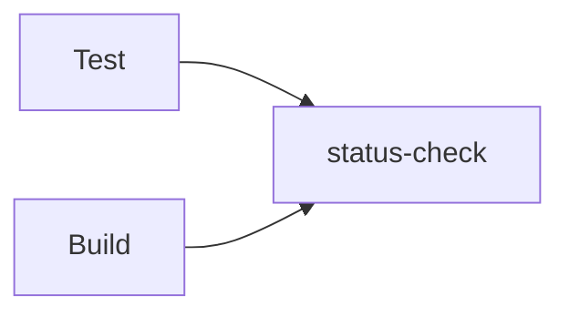

# example-required-status-check-action

[](https://raw.githubusercontent.com/suzuki-shunsuke/example-required-status-check-action/main/LICENSE) | [workflow](.github/workflow/pull_request.yaml)

Example of [required-status-check-action](https://github.com/suzuki-shunsuke/required-status-check-action)

## Configure Branch Rulesets

1. Enable `Require status checks to pass`
1. Add `status-check` to `Status checks that are required`


## Example 1



Set up the workflow.
To merge pull requests, the jobs `test` and `build` must pass.

```yaml
name: pull request
on: pull_request
jobs:
  test:
    runs-on: ubuntu-24.04
    permissions: {}
    timeout-minutes: 10
    steps:
      - run: test -n "$FOO"
        env:
          FOO: ${{vars.FOO}}
  build:
    runs-on: ubuntu-24.04
    permissions: {}
    timeout-minutes: 10
    steps:
      - run: test -n "$FOO"
        env:
          FOO: ${{vars.FOO}}
  status-check:
    runs-on: ubuntu-24.04
    timeout-minutes: 10
    needs:
      - test
      - build
    if: always()
    permissions:
      contents: read # To get the workflow content by GitHub API
    steps:
      - uses: suzuki-shunsuke/required-status-check-action@latest
        with:
          needs: ${{ toJson(needs) }}
```

The variable `FOO` is used in the workflow, but please don't set the variable first.
Let's create a pull request, the workflow fails.
The job `foo` and `bar` fail, so `status-check` fails.
`status-check` fails, so the pull request can't be merged expectedly.

## Example 2. A invalid

## Example 3. Add a job

## Example 4. Run workflow check only when workflow is changed
