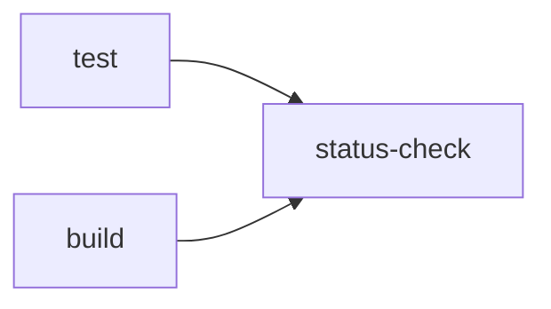
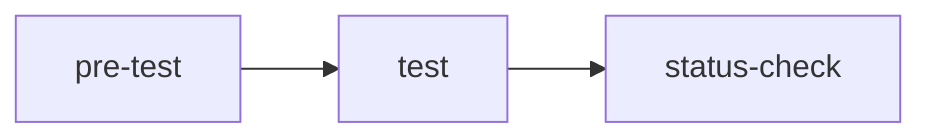

# example-required-status-check-action

[](https://raw.githubusercontent.com/suzuki-shunsuke/example-required-status-check-action/main/LICENSE) | [workflow](.github/workflow/pull_request.yaml)

This repository is an example of [required-status-check-action](https://github.com/suzuki-shunsuke/required-status-check-action)

## 1. Configure Branch Rulesets

1. Enable `Require status checks to pass`
1. Add `status-check` to `Status checks that are required`


## 2. Set up the workflow



Set up the workflow.
To merge pull requests, the jobs `test` and `build` must pass.

```yaml
name: pull request
on: pull_request
jobs:
  test:
    runs-on: ubuntu-24.04
    permissions: {}
    timeout-minutes: 10
    steps:
      - run: test -n "$FOO"
        env:
          FOO: ${{vars.FOO}}
  build:
    runs-on: ubuntu-24.04
    permissions: {}
    timeout-minutes: 10
    steps:
      - run: test -n "$FOO"
        env:
          FOO: ${{vars.FOO}}
  status-check:
    runs-on: ubuntu-24.04
    timeout-minutes: 10
    needs:
      - test
      - build
    if: always()
    permissions:
      contents: read # To get the workflow content by GitHub API
    steps:
      - uses: suzuki-shunsuke/required-status-check-action@latest
        with:
          needs: ${{ toJson(needs) }}
```

The variable `FOO` is used in the workflow, but please don't set the variable first.
Let's create a pull request, the workflow fails.
The job `test` and `build` fail, so `status-check` fails.
`status-check` fails, so the pull request can't be merged expectedly.

- [commit](https://github.com/suzuki-shunsuke/example-required-status-check-action/pull/3/commits/f40fb97b379273926a8444813ad7c75987360d71)
- [workflow](https://github.com/suzuki-shunsuke/example-required-status-check-action/actions/runs/13671523965?pr=3)


Then set the variable `FOO` and rerun only `test`.


Then `test` succeeds but `status-check` fails expectedly because `build` fails.


Then `Re-run failed jobs`.


Then all jobs succeed. `status-check` succeeds because `test` and `build` succeed.


## 3. Add a new job

Let's add a new job `check`.

```yaml
name: pull request
on: pull_request
jobs:
  test:
    runs-on: ubuntu-24.04
    permissions: {}
    timeout-minutes: 10
    steps:
      - run: test -n "$FOO"
        env:
          FOO: ${{vars.FOO}}
  build:
    runs-on: ubuntu-24.04
    permissions: {}
    timeout-minutes: 10
    steps:
      - run: test -n "$FOO"
        env:
          FOO: ${{vars.FOO}}
  check:
    runs-on: ubuntu-24.04
    permissions: {}
    timeout-minutes: 10
    steps:
      - run: test -n "$FOO"
        env:
          FOO: ${{vars.FOO}}
  status-check:
    runs-on: ubuntu-24.04
    timeout-minutes: 10
    needs:
      - test
      - build
    if: always()
    permissions:
      contents: read # To get the workflow content by GitHub API
    steps:
      - uses: suzuki-shunsuke/required-status-check-action@latest
        with:
          needs: ${{ toJson(needs) }}
```

Note that `check` isn't included in `status-check`'s `needs` now.

Then all jobs except for `status-check` pass but `status-check` fails because `check` isn't included in `status-check`'s `needs`.


```
Error: The job check must be added to status-check's needs or ignored_jobs
```

To solve the error, let's add `check` to `status-check`'s `needs`.

```yaml
  status-check:
    runs-on: ubuntu-24.04
    timeout-minutes: 10
    needs:
      - test
      - build
      - check
```

Then all jobs pass.


## 4. Ignore some jobs

Maybe you want to run any jobs after `status-check`.
Let's add a job `merge` and add `status-check` to the job's `needs`.

```yaml
  merge:
    runs-on: ubuntu-24.04
    permissions: {}
    timeout-minutes: 10
    needs:
      - status-check
    steps:
      - run: test -n "$FOO"
        env:
          FOO: ${{vars.FOO}}
```

Then `status-check` fails because `merge` isn't included in `needs` of `status-check`.


```
Error: The job merge must be added to status-check's needs or ignored_jobs
```

Of course, you can't add `merge` to `needs` of `status-check`.
To resolve the error, please add `merge` to `ignored_jobs` of `status-check`.

```yaml
- uses: suzuki-shunsuke/required-status-check-action@latest
  with:
    needs: ${{ toJson(needs) }}
    ignored_jobs: |
      merge
```

Then `status-check` passes.


You can also ignore multiple jobs.

```yaml
    ignored_jobs: |
      merge
      after-merge
```

## Indirect dependencies aren't allowed

Let's say `status-check` depends on `pre-test` indirectly.



In that case, you need to add `pre-test` to `needs` of `status-check` because `require-status-check-action` may pass even if `pre-test` fails.

```yaml
  status-check:
    runs-on: ubuntu-24.04
    timeout-minutes: 10
    needs:
      - pre-test
      - test
```

## Run workflow check only when workflow is changed

By default, `required-status-check-action` gets the workflow file and checks jobs' `needs`.
But in general, you don't need to check it unless the workflow file is changed.

So you can skip the check by the input `check_workflow`.

The action [dorny/paths-filter](https://github.com/dorny/paths-filter) is useful.

```yaml
jobs:
  path-filter:
    timeout-minutes: 10
    runs-on: ubuntu-latest
    permissions:
      pull-requests: read
    outputs:
      workflow: ${{steps.changes.outputs.workflow}}
    steps:
      - uses: dorny/paths-filter@de90cc6fb38fc0963ad72b210f1f284cd68cea36 # v3.0.2
        id: changes
        with:
          filters: |
            workflow:
              - .github/workflows/pull_request.yaml
  status-check:
    runs-on: ubuntu-24.04
    timeout-minutes: 10
    needs:
      - path-filter
      - test
      - build
      - check
    if: always()
    permissions:
      contents: read # To get the workflow content by GitHub API
    steps:
      - uses: suzuki-shunsuke/required-status-check-action@latest
        with:
          needs: ${{ toJson(needs) }}
          check_workflow: ${{ needs.path-filter.outputs.workflow }}
```
